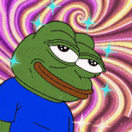
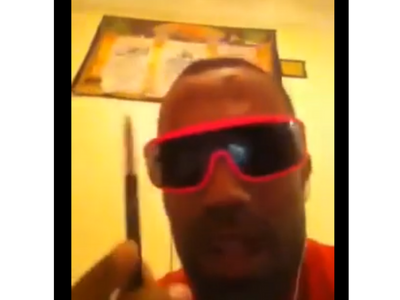
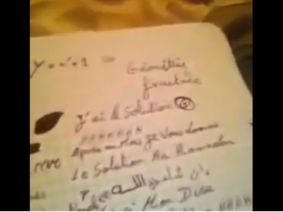
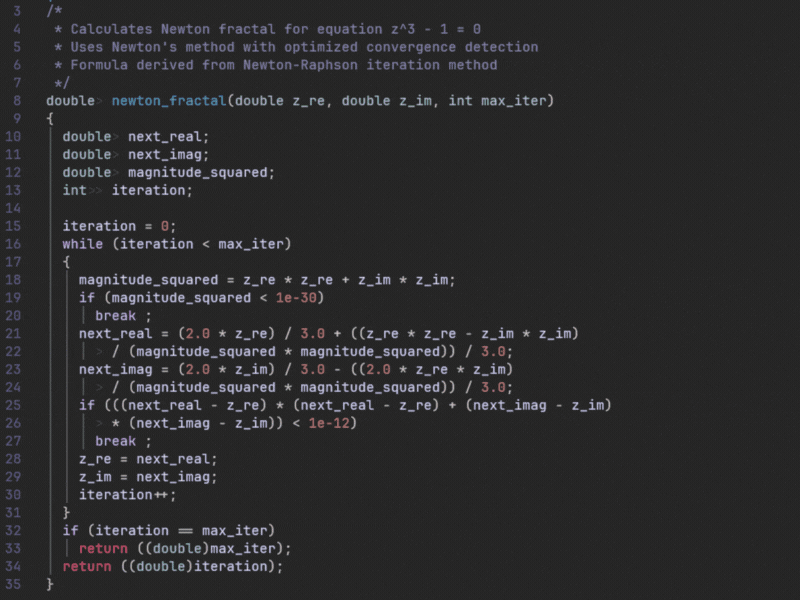
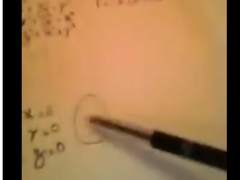
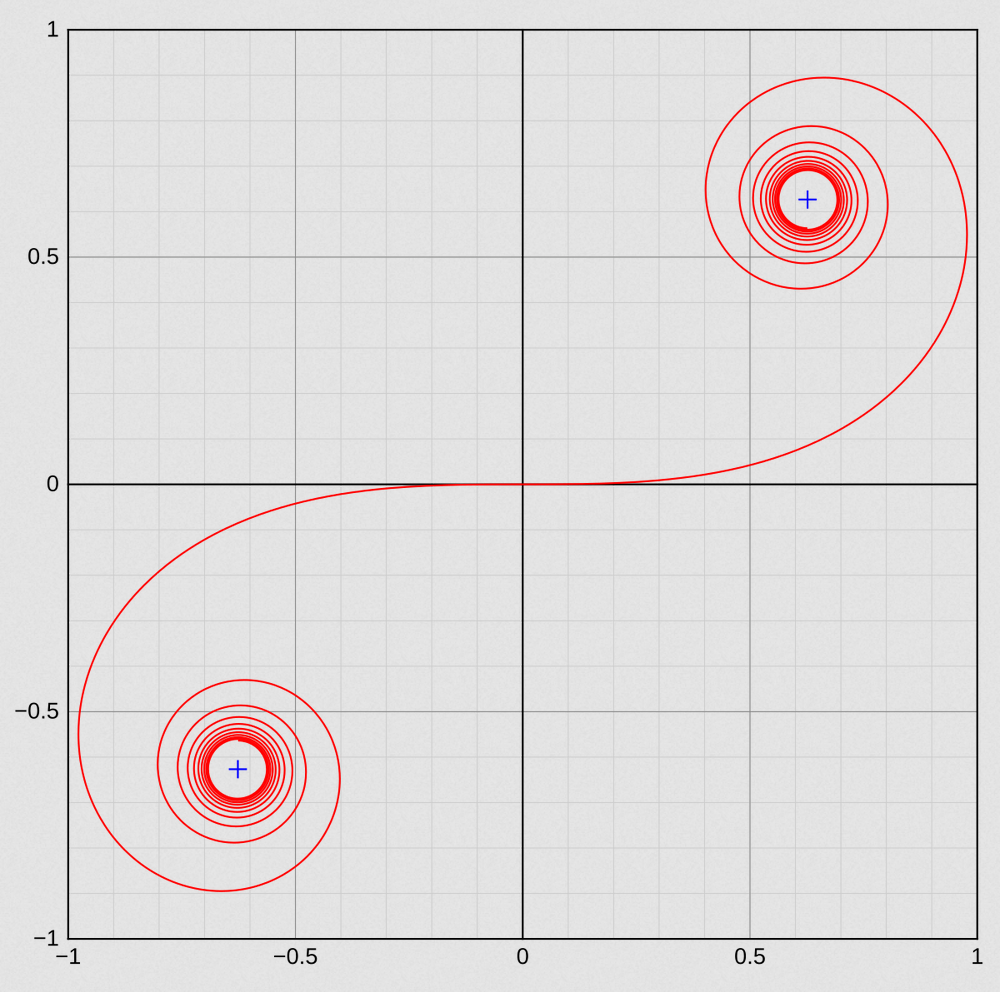

<p align="center">
  
</p>

<p align="center">
  
  
  
</p>

<p align="center">
  
  
  
  
  
</p>

---
<p align="center">
  
  <table>
  <tr>
  <td width="10%">
    
  </td>
  <td width="40%">
    <h3 align="center">
      <em>「 Where You Will Lose Contact With Life 」</em>
    </h3>
  </td>
  </tr>
  </table>
  
</p>
---

<br>

<-- ═══════════════════════════════════════════════════════════════════════════ -->
<-- ░░░░░░░░░░░░░░░░░░░░░ THE MOUL NDADER SPEECH ░░░░░░░░░░░░░░░░░░░░░░░░░░░░░░ -->
<-- ═══════════════════════════════════════════════════════════════════════════ -->

<h2 align="center">🎤 THE SPEECH 🎤</h2>

**Alright, SALAM O ALAYKUM *brothers*...**

PEACE to all the homies that they like us...  
and for the haters that they don't like us... ***you already know***

---
<p align="center">
  
</p>

<div align="center">

---


</div>

<br>

> **Big dédicace to:**
> 
> 🎯 My brother **Lotfi aniki** a.k.a BH madfack tu connais...  
> 💎 Frérot **KiKi**, do you love me  
> 🔥 **Anisse aniki** brovski  
> 👑 Ladies and gentlemen **housii ya3ni**  
> ⚡ And of course we will not forget **shawz** my.. real.. G..  
> *the one who inspired this whole madness...*

<br>

<p align="center">
  👉 <em>Make sure to check his legendary document</em> 👈
</p>

<br>

<div align="center">

**SHOUTOUT to all the homies worldwide, especially:**

<p align="center">
    **· Oujda**     
    **· Angers** 
    **· Batna** 
    **· Rabat** 
    **· Lille** 
    **· CASA ..** 
</p>

</div>

<br>

---

<br>

<h3 align="center">ANYWHO...</h3>

<p align="center">
  <strong>I got a message to share.</strong>
</p>

<p align="center">
  But before that message...<br>
  I want you to take a look at this <strong>TEE-SHIRT</strong> right here which is:
</p>

<br>

<p align="center">
  
</p>

<h3 align="center">
  「 IT'S NOT A GAME 」
  <br>
  <sub>of San Andreas</sub>
</h3>
<br>

<div align="center">

We're not doing games over here...  
Ain't no so long...  
**NAAAH...**

---

This is **Fractol**... the real thing...

</div>

<br>

<table align="center">
<tr>
<td>

> *The gate to a psychedelic realm*  
> *Infinite patterns*  
> *Getting high by mathematics*  
> *Zooming... until reaching nirvana*  
> *Games? That's for later. Now we're hustling pixels...*  
> *WE ARE here to grind...*  
>
> **IRON MAN WILL DIE.**

</td>
</tr>
</table>

<br>

---

<br>

<h3 align="center">ANYWHO... Let's start</h3>

<p align="center">
  
</p>

<div align="center">

*Shout out to anyone who's studying hard.*  
*And we don't f\*\*k with the lazy people...*  
*Study and keep studying*

</div>

<br>

<p align="center">
  
</p>

<h4 align="center">
  ✒️ <strong>The pen</strong>... is the weapon... ✒️
  <br><br>
  <em>Let us study and focus on ourselves...</em>
  <br>
  <em>Watching others won't get you sh*t</em>
</h4>

<br>

---

<br>

<!-- ═══════════════════════════════════════════════════════════════════════════ -->
<!-- ░░░░░░░░░░░░░░░░░░░░░░░░░ THE MATHEMATICS ░░░░░░░░░░░░░░░░░░░░░░░░░░░░░░░░░ -->
<!-- ═══════════════════════════════════════════════════════════════════════════ -->

<h2 align="center">📐 THE MATHEMATICS 📐</h2>

<br>

<h4 align="center">The Newton-Raphson iteration formula that you guys struggle with:</h4>

<p align="center">
  
</p>

<p align="center">
  where <code>a = 1</code> and <code>p(z) = z³ - 1</code>
</p>

<br>

<p align="center">
  
</p>

<p align="center">
  <em>I got the solution...</em>
  
  <br><br>
  I'm joking... here is the <strong>real</strong> solution:
</p>

<br>

<p align="center">
  
</p>

<br>

---

<br>

<h4 align="center">And the second formula of <strong>Mister Julia</strong> that you still sleeping on... here it is:</h4>

<p align="center">
  
</p>

<br>

<p align="center">
  
</p>

<p align="center">
  And it doesn't converge to 0 bonehead... no... doesn't stay close to 0
  <br><br>
  Instead <code>|z|</code> should <strong>not escape to infinity</strong> which means <code>|z| < 2</code>
  <br>
  It must always remain <strong>bounded</strong> and not escape
</p>

<br>

<h4 align="center">And also draw the curve (Euler Curve)...</h4>
<p align="center"><em>if you don't, I'll show you...</em></p>
<p align="center"><strong>I'll show you who I am...</strong></p>

<br>

<p align="center">
  
</p>

<br>

---

<br>

<div align="center">

*F\*\*k the world.*  
*F\*\*k money*  
*And f\*\*k fame*

Anyone challenging me  
Bring the Guinness World Records book,  
I'll challenge them right back.  
I'll show him the solution  
I'm not afraid of nobody  
**I only fear God.**

<br>

**Iron Man will die.**

**Only study.**  
**Only hustle.**

**Stay humble.**

</div>

<br>

---

<br>

<!-- ═══════════════════════════════════════════════════════════════════════════ -->
<!-- ░░░░░░░░░░░░░░░░░░░░░░░░░░░ TRIP START ░░░░░░░░░░░░░░░░░░░░░░░░░░░░░░░░░░░ -->
<!-- ═══════════════════════════════════════════════════════════════════════════ -->

<h1 align="center">
  <br>
  🌈 ═══════════════════════════════ 🌈
  <br><br>
  T R I P &nbsp; S T A R T
  <br><br>
  🌈 ═══════════════════════════════ 🌈
  <br>
</h1>

<br>

<p align="center">
  But wait...
  <br><br>
  Have you ever wondered what a <strong>trip</strong> looks like?
</p>

<br>

<div align="center">

That psychedelic realm where:

🫁 **Shapes breathe**  
🎵 **Colors have a sound**  
❌ **Familiar rules no longer apply**  
🧠 **You forget who you are... and remember everything**

</div>

<br>

<p align="center">
  That place where you're not <em>alive</em> anymore...
  <br>
  but not <em>dead</em> either.
</p>

<br>

<p align="center">
  If you've ever been curious...
  <br><br>
  <strong>You came to the right place.</strong>
</p>

<br>

<h3 align="center">
  Welcome to my fractals.
  <br>
  Welcome to the trip.
</h3>

<br>

<p align="center">
  
</p>

<br>

---

<br>

<!-- ═══════════════════════════════════════════════════════════════════════════ -->
<!-- ░░░░░░░░░░░░░░░░░░░░░░░░ 1. MANDELBROT SET ░░░░░░░░░░░░░░░░░░░░░░░░░░░░░░░ -->
<!-- ═══════════════════════════════════════════════════════════════════════════ -->

<h2>🟢 1. MANDELBROT SET</h2>

<h3><em>🍃 Amnesia — the weed effect 🍃</em></h3>

<br>

<p align="center">
  
  
  
</p>

<br>

This... is **Mandelbrot**.

Have you ever wondered what it feels like to smoke **Amnesia**?

> That chill sensation.  
> Your thoughts slow down.  
> You care less about anything.  
> Everything becomes... peaceful.

You zoom.  
You forget.  
You zoom again.  
And forget why you started zooming in the first place?

Patterns repeat.  
But you don't remember seeing them before.

This fractal is associated with **Amnesia**—  
a calm, hypnotic state where everything feels *soft*  
and infinity feels... familiar

<br>

```bash
./fractol mandelbrot
```

<br>

<details>
<summary><h4>🌿 [ Watch the Mandelbrot Trip ] 🌿</h4></summary>

<br>

<p align="center">

[Video: mandelbrot-trip.mp4]

*Zoom infinitely into the calm, hypnotic patterns...*

</p>

</details>

<br>

---

<br>

<!-- ═══════════════════════════════════════════════════════════════════════════ -->
<!-- ░░░░░░░░░░░░░░░░░░░░░░░░░░ 2. JULIA SET ░░░░░░░░░░░░░░░░░░░░░░░░░░░░░░░░░░ -->
<!-- ═══════════════════════════════════════════════════════════════════════════ -->

<h2>💜 2. JULIA SET</h2>

<h3><em>💊 Mister Julia — MDMA / Ecstasy 💊</em></h3>

<br>

<p align="center">
  
  
  
</p>

<br>

Meet **Mister Julia**.

This one hits different.

This one reacts to your parameters.  
Every small change reshapes reality.  
Like emotions amplified.

> Warmth.  
> Connection.  
> Euphoria.

Like feeling everything at once.  
A lot of colors that bond together.

You feel close —  
to the fractal,

This is the **MDMA trip** of fractals.  
You don't just *see* it —  
you **feel** it.

<br>

```bash
./fractol julia -0.7 0.27015    # ← Classic
./fractol julia -0.75 0.11      # ← Spiral
./fractol julia 0.285 0.01      # ← Lightning
./fractol julia -0.4 0.6        # ← Dragon
./fractol julia -0.8 0.156      # ← Rabbit
```

<br>

<details>
<summary><h4>💜 [ Enter Mister Julia's World ] 💜</h4></summary>

<br>

<p align="center">

[Video: julia-trip.mp4]

*Feel the warmth, the connection, the euphoria...*

</p>

</details>

<br>

---

<br>

<!-- ═══════════════════════════════════════════════════════════════════════════ -->
<!-- ░░░░░░░░░░░░░░░░░░░░░░░░░░ 3. NEWTON SET ░░░░░░░░░░░░░░░░░░░░░░░░░░░░░░░░░ -->
<!-- ═══════════════════════════════════════════════════════════════════════════ -->

<h2>🔴 3. NEWTON SET</h2>

<h3><em>👅 LSD — Acid Trip ☣️</em></h3>

<br>

<p align="center">
  
  
  
</p>

<br>

Now... hold tight.

This is **Newton**.

This one is quite dangerous... but it's my favorite.

It looks mathematical at first —  
but one step too far...  
and reality breaks into **WOOOAAA**.. Colors explode

There's no difference anymore between what's real... and what's not

> You **don't look at it**.  
> You **fall into it**.

You don't control it.  
You don't fight it.  
You don't get afraid of it.

**You accept it.**  
**You appreciate it.**  
**You surrender to it.**

This is the acid trip.  
Pure math hallucinating in real time.

<br>

```bash
./fractol newton
```

<br>

<details>
<summary><h4>🔴 [ Drop the Acid — Newton Set ] 🔴</h4></summary>

<br>

<p align="center">

[Video: newton-trip.mp4]

*Fall into the mathematical void... surrender...*

</p>

</details>

<br>

---

<br>

<!-- ═══════════════════════════════════════════════════════════════════════════ -->
<!-- ░░░░░░░░░░░░░░░░░░░░░░░░░░ 4. FLOWER SET ░░░░░░░░░░░░░░░░░░░░░░░░░░░░░░░░░ -->
<!-- ═══════════════════════════════════════════════════════════════════════════ -->

<h2>🌸 4. FLOWER SET</h2>

<h3><em>🍄 Mushrooms — Hearing colors 🍄</em></h3>

<br>

<p align="center">
  
  
  
</p>

<br>

The final stage... The **Flower**.

This one breathes.

> Colors don't just move —  
> they **sing**.
>
> Colors don't just appear —  
> they **sound**.

You hear shapes.  
You see sound.

Everything flows.  
Nature speaks.

**Geometry breathes.**

This is the mushroom trip.  
This is where math becomes **spiritual**.  
And starts being life.

<br>

```bash
./fractol flower
```

<br>

<details>
<summary><h4>🌸 [ Hear the Colors ] 🌸</h4></summary>

<br>

<p align="center">

[Video: flower-trip.mp4]

*Where math becomes spiritual... where geometry breathes...*

</p>

</details>

<br>

---

<br>

<!-- ═══════════════════════════════════════════════════════════════════════════ -->
<!-- ░░░░░░░░░░░░░░░░░░░░░░░░░░░░ CONTROLS ░░░░░░░░░░░░░░░░░░░░░░░░░░░░░░░░░░░░ -->
<!-- ═══════════════════════════════════════════════════════════════════════════ -->

<h2 align="center">⌨️ CONTROLS ⌨️</h2>

<br>

<div align="center">

| Key | Action |
|:---:|:---|
| 🖱️ **Mouse wheel** | Zoom in/out |
| ⬅️➡️⬆️⬇️ **Arrow keys** | Pan view |
| `Space` | Julia mouse follow |
| `+` / `-` | Cycle color palettes |
| `R` | Reset view |
| `ESC` | Exit |

</div>

<br>

---

<br>

<!-- ═══════════════════════════════════════════════════════════════════════════ -->
<!-- ░░░░░░░░░░░░░░░░░░░░░░░░░ COLOR PALETTES ░░░░░░░░░░░░░░░░░░░░░░░░░░░░░░░░░ -->
<!-- ═══════════════════════════════════════════════════════════════════════════ -->

<h2 align="center">🌈 COLOR PALETTES 🌈</h2>

<br>

<div align="center">

| # | Name | Vibe |
|:---:|:---|:---|
| 0 | **Neon Pink** | 💗 Hot, electric |
| 1 | **Electric Blue** | 💙 Cool, oceanic |
| 2 | **Acid Green** | 💚 Matrix, toxic |
| 3 | **Solar Flare** | 🧡 Warm, fiery |
| 4 | **Deep Purple** | 💜 Royal, cosmic |
| 5 | **Cosmic** | 🌌 Space, nebula |
| 6 | **Plasma Storm** | ⚡ Energy, lightning |
| 7 | **Psychedelic** | 🌈 Full rainbow chaos |

</div>

<br>

---

<br>

<!-- ═══════════════════════════════════════════════════════════════════════════ -->
<!-- ░░░░░░░░░░░░░░░░░░░░░░░░░░ INSTALLATION ░░░░░░░░░░░░░░░░░░░░░░░░░░░░░░░░░░ -->
<!-- ═══════════════════════════════════════════════════════════════════════════ -->

<h2 align="center">🔧 INSTALLATION 🔧</h2>

<br>

```bash
# Clone the repository
git clone https://github.com/yourusername/fractol.git

# Navigate to directory
cd fractol

# Compile
make

# Run
./fractol mandelbrot
./fractol julia -0.7 0.27015
./fractol newton
./fractol flower
```

<br>

---

<br>

<!-- ═══════════════════════════════════════════════════════════════════════════ -->
<!-- ░░░░░░░░░░░░░░░░░░░░░░░ TECHNICAL DOCUMENTATION ░░░░░░░░░░░░░░░░░░░░░░░░░░ -->
<!-- ═══════════════════════════════════════════════════════════════════════════ -->

<h2 align="center">📚 TECHNICAL DOCUMENTATION 📚</h2>

<br>

<p align="center">
  For the nerds who want to understand the math behind the madness:
  <br><br>
  <a href="TECHNICAL.md"><strong>📐 Read the Technical Documentation →</strong></a>
</p>

<br>

<details>
<summary><h4>📖 What's inside?</h4></summary>

<br>

- **🔍 The Zooming Mechanism** — How infinite zoom actually works
- **🎨 Color Rendering System** — The psychedelic color algorithm
- **🏗️ Project Architecture** — High-level code overview
- **🔢 Fractal Algorithms** — The math behind each fractal

</details>

<br>

---

<br>

<!-- ═══════════════════════════════════════════════════════════════════════════ -->
<!-- ░░░░░░░░░░░░░░░░░░░░░░░░░░░░░ FOOTER ░░░░░░░░░░░░░░░░░░░░░░░░░░░░░░░░░░░░░ -->
<!-- ═══════════════════════════════════════════════════════════════════════════ -->

<br>

<h2 align="center">
  🌀 ═══════════════════════════════ 🌀
</h2>

<br>

<p align="center">
  
</p>

<br>

<p align="center">
  <em>「 ...( ◎.◎ ).. Let's Dive into the infinite... 」</em>
</p>

<br>

<p align="center">
  <strong>Made with 🧠 mathematics and ✨ madness</strong>
  <br><br>
  <sub>A 42 School Project by <a href="https://github.com/yourusername">zotaj-di</a></sub>
</p>

<br>

<p align="center">
  
</p>

<br>

---

<p align="center">
  <sub>
    ⚠️ <em>Disclaimer: This README is themed around psychedelic experiences for creative/artistic purposes only. 
    <br>The author does not endorse or encourage the use of illegal substances.</em> ⚠️
  </sub>
</p>
